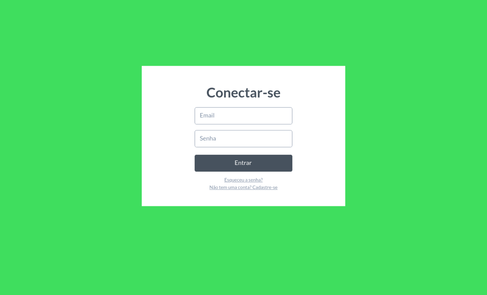
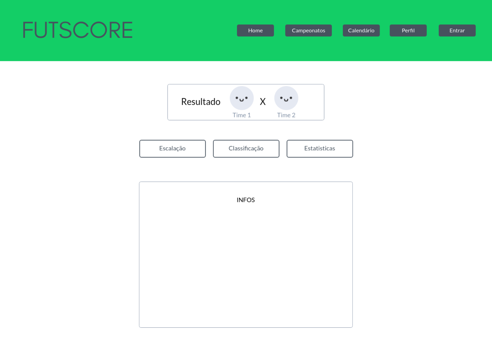

# Projeto de Interface

O projeto de interface do Futscore visa proporcionar uma experiência de usuário intuitiva e agradável. Para isso, foram elaborados wireframes para cada página do site, seguindo as especificações funcionais e não funcionais definidas na documentação de especificação.

## User Flow

A imagem acima apresenta o diagrama que ilustra o fluxo de interação do usuário pelas telas do sistema. As telas desse fluxo são detalhadas na seção de Wireframes abaixo.

## Wireframes

Todos os wireframes foram elaborados com o objetivo de tornar o site fácil de navegar e proporcionar uma experiência de usuário fluida e agradável.

### Homepage

A Homepage é a página principal do site e apresenta jogos em destaque, campeonatos e uma barra de pesquisa para procurar seu time do coração.

### Login

Na página de Login, o usuário pode inserir suas credenciais para acessar sua conta.

### Cadastro

A página de Cadastro apresenta um formulário simples e objetivo, com campos obrigatórios para o usuário preencher.

### Recuperar senha

A página de Recuperar Senha permite que o usuário redefina sua senha caso tenha esquecido.

### Perfil

Na página de perfil o usuário pode trocar sua foto de perfil, escolher seu time do coração, ver os ultimos resultados dos jogos do seu time, classificação nos campeonatos e próximos jogos.

### Tabelas 

Na página de Tabelas, o usuário pode visualizar as tabelas de classificação e os resultados dos jogos.

### Calendário

O Calendário de Jogos apresenta uma visão geral dos próximos jogos e permite que o usuário confira o calendário de jogos da temporada atual.

### Estatísticas 

A página de Estatísticas exibe as informações detalhadas sobre os jogos, incluindo escalação, placar, cartões, substituições e outras estatísticas relevantes.

