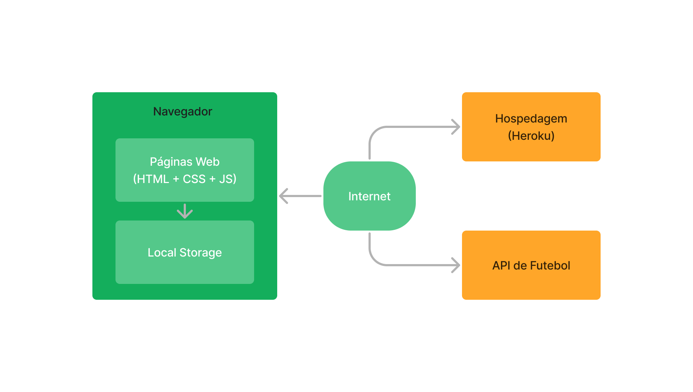

# Arquitetura da Solução

O software do FutScore será estruturado em três componentes principais: HTML, CSS e JavaScript. Para fornecer os dados dos jogos, vamos utilizar uma API de futebol. A aplicação será hospedada no Heroku e os dados do usuário serão armazenados em Local Storage. Essa arquitetura permitirá que o site seja rápido, escalável e fácil de manter.

## Diagrama de componentes

Os componentes que fazem parte da solução são apresentados na imagem abaixo.

Arquitetura da Solução

A solução implementada conta com os seguintes módulos:
- **Navegador** - Interface básica do sistema  
  - **Páginas Web** - Conjunto de arquivos HTML, CSS, JavaScript e imagens que implementam as funcionalidades do sistema.
   - **Local Storage** - armazenamento mantido no Navegador, onde são implementados bancos de dados baseados em JSON. São eles: 
     - **Credenciais** - Dados do usuário, como login e senha
     - **Time do coração** - Time que o usuário torce
 - **API de futebol** - API que será usada para ter acesso a todas as informações sobre os times e campeonatos.
 - **Hospedagem** - local na Internet onde as páginas são mantidas e acessadas pelo navegador. 

## Tecnologias Utilizadas

Descreva aqui qual(is) tecnologias você vai usar para resolver o seu problema, ou seja, implementar a sua solução. Liste todas as tecnologias envolvidas, linguagens a serem utilizadas, serviços web, frameworks, bibliotecas, IDEs de desenvolvimento, e ferramentas.

Apresente também uma figura explicando como as tecnologias estão relacionadas ou como uma interação do usuário com o sistema vai ser conduzida, por onde ela passa até retornar uma resposta ao usuário.

## Hospedagem

Explique como a hospedagem e o lançamento da plataforma foi feita.
