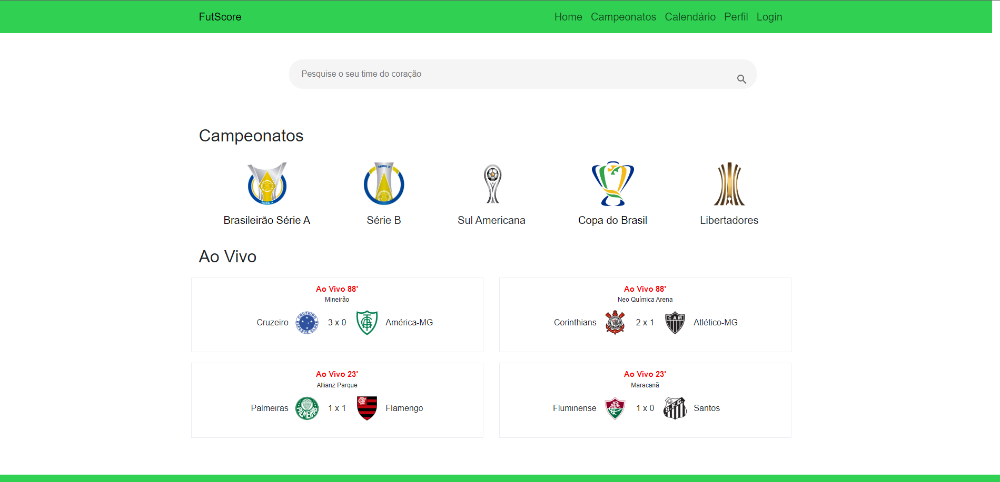
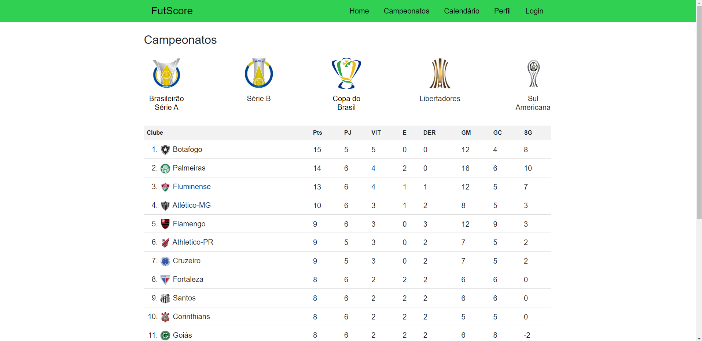
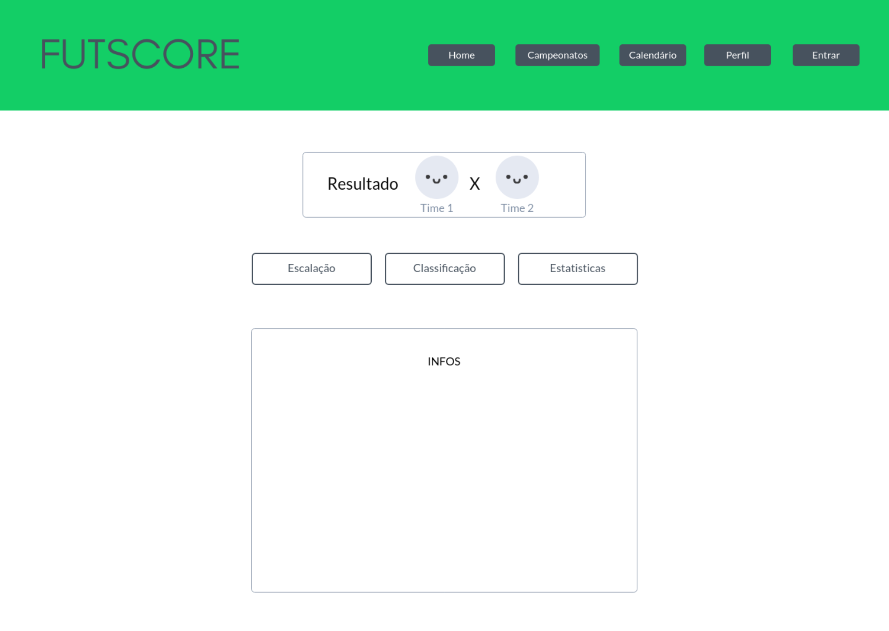
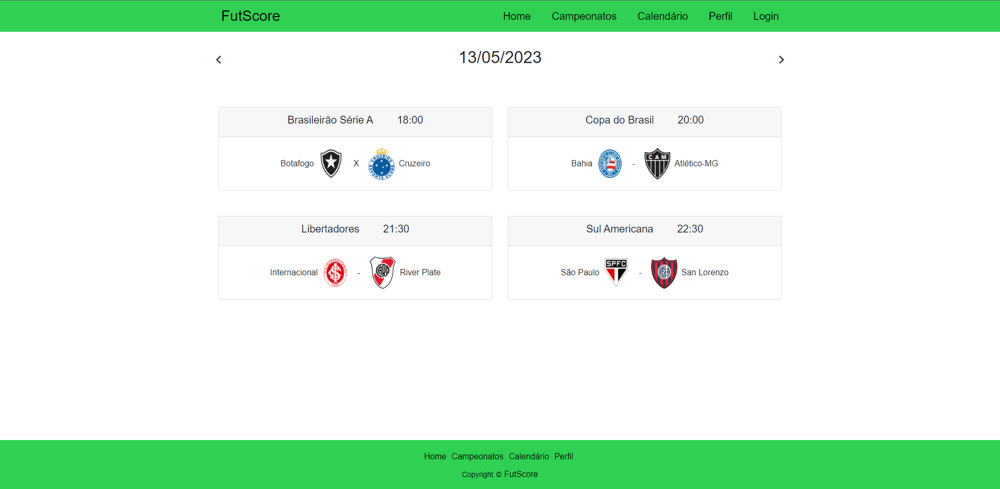
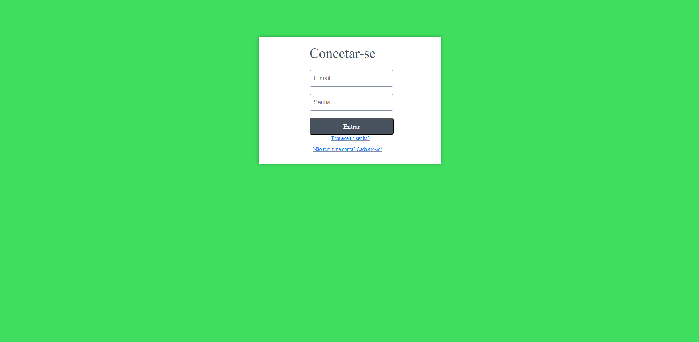
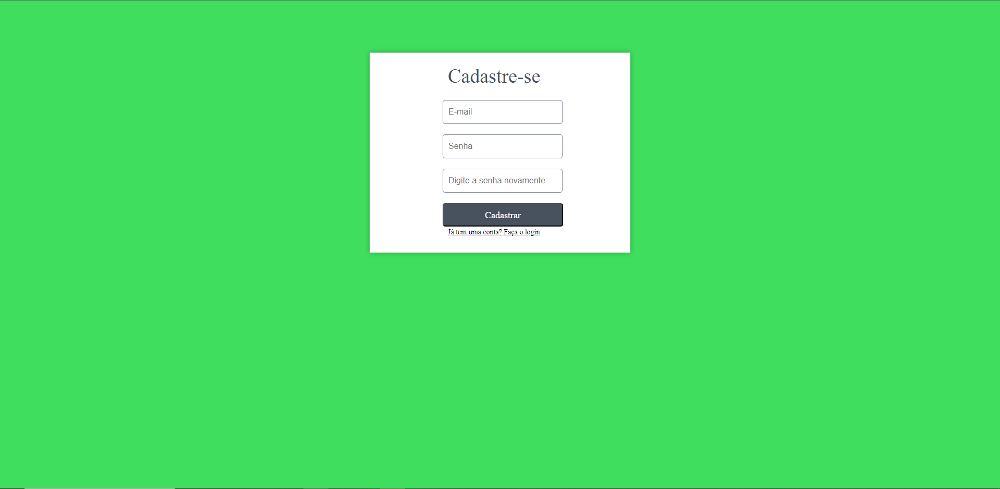
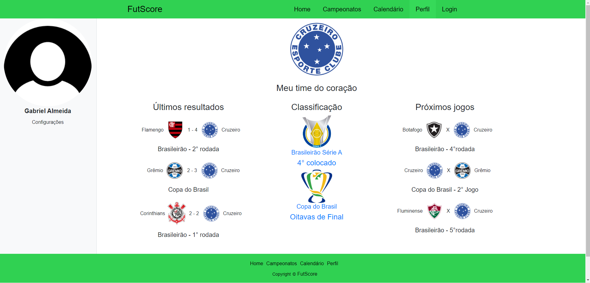

# Programação de Funcionalidades

Pré-requisitos: <a href="2-Especificação do Projeto.md"> Especificação do Projeto</a>, <a href="3-Projeto de Interface.md"> Projeto de Interface</a>, <a href="4-Metodologia.md"> Metodologia</a>, <a href="3-Projeto de Interface.md"> Projeto de Interface</a>, <a href="5-Arquitetura da Solução.md"> Arquitetura da Solução</a>

Nesta seção são apresentadas as telas desenvolvidas para cada uma das funcionalidades
do sistema. O respectivo endereço (URL) e outras orientações de acesso são são
apresentadas na sequência.

## 1. Homepage (RF-01)

Nesta sessão, o usuário, assim que abrir o site verá os jogos que estão acontecendo no momento.
### 1.1 Requisitos atendidos:
* RF-01 O site deve apresentar placares ao vivo de jogos de futebol.

### 1.2 Artefatos da funcionalidade:
* index.html
* style.css

## 2. Campeonatos (RF-02)

Nesta sessão, o usuário poderá consultar as tebelas dos campeonatos: Brasileirão Série A, Brasileirão Série B, Copa do Brasil, Libertadores e Sul-Americana.

### 2.1 Requisitos atendidos:
* RF-02  O site deve exibir tabelas das competições.

### 2.2 Artefatos da funcionalidade:
* style.css
* tabelacdb.html
* tabelaserieA.html
* tabelaserieB.html

## 3. Estatisticas (RF-03)

Nesta sessão, o usuário poderá ver as estatísticas completas do jogo do seu interesse.

### 3.1 Requisitos atendidos:
* RF-03 O site deve exibir estatísticas dos jogos das competições.

### 3.2 Artefatos da funcionalidade:

* estatísticas.html
* style.css

## 4. Calendário (RF-04)

Nesta sessão poderá consultar o calendario de futuros jogos.

### 4.1 Requisitos atendidos:
* RF-04 O site deve permitir o acesso a calendários de jogos futuros e partidas.

### 4.2 Artefatos da funcionalidade:

* Calendario.html
* style.css

## 5. Login (RF-05)

Nesta sessão, o usuário poderá logar no site, caso não tenha conta, se cadrastrar para que tenha acesso ao perfil personalizado.

### 5.1 Requisitos atendidos:
* RF-05 O site deve permitir que os usuários crie sua conta.

### 5.2 Artefatos da funcionalidade:

* login.html
* criação.html
* recuperarsenha.html
* style.css

## 6. Perfil (RF-06)

Nesta sessão, o usuário que estiver logado, poderá ter acesso ao seu perfil personalizado com seu time do coração.

### 6.1 Requisitos atendidos:
* RF-06 O site deve permitir que os usuários tenha acesso a sua página de perfil personalizada.

### 6.2 Artefatos da Funcionalidade

* style.css
* Perfil.html
