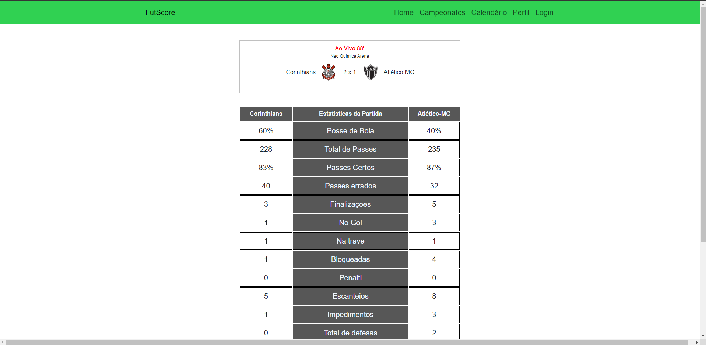
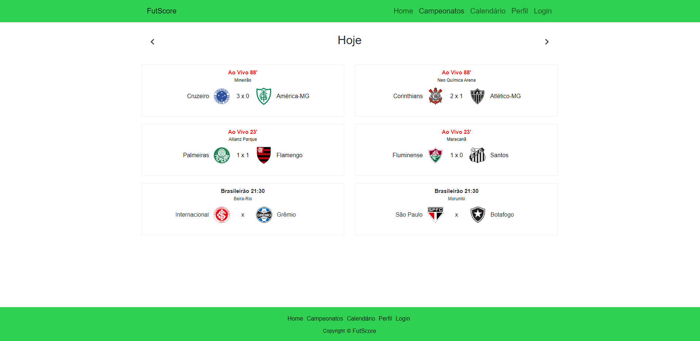
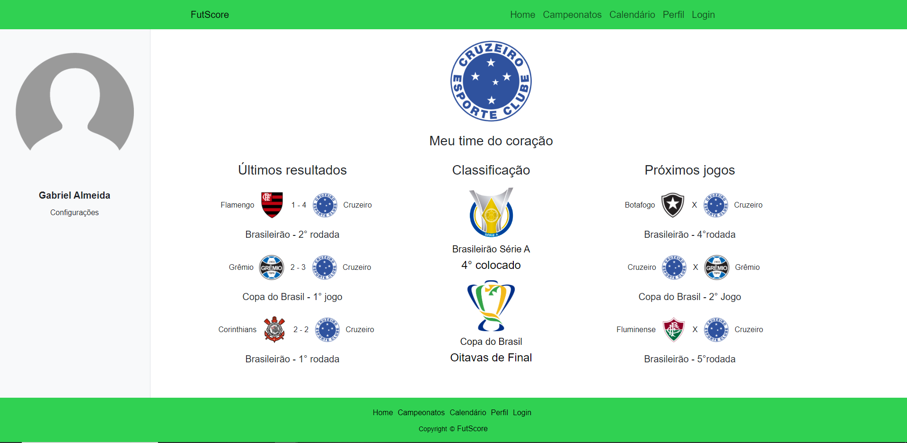
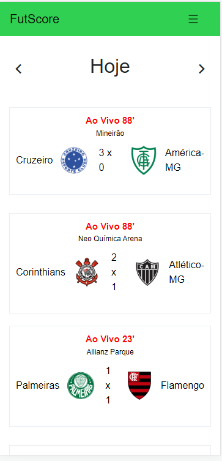
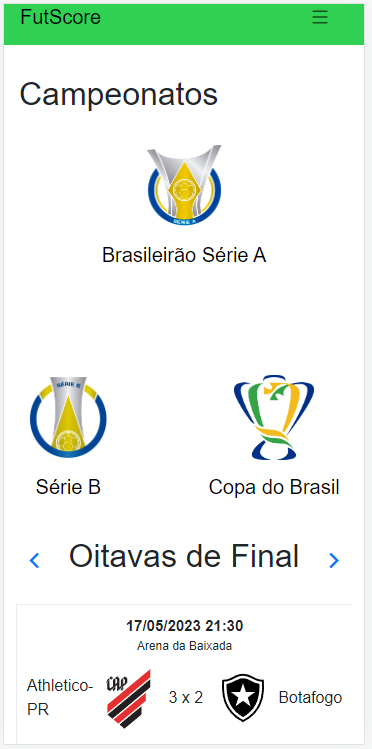

# Registro de Testes de Software

Os resultados obtidos nos testes de software realizados:

Casos de Teste:

T01 - Tabelas

T02 - Estatística 

T03 - Calendário

T05 - Personalização do Perfil

T06 - Responsividade do site

